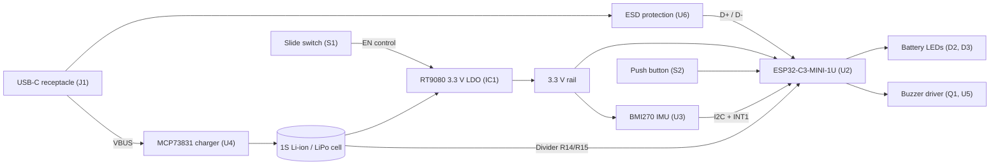

# Smart Hydration Reminder PCB

A compact, low-power, wireless-capable PCB designed to live in a water bottle base or sleeve. It detects when you drink using a 6-axis IMU, keeps a running record of intake events, and reminds you with a buzzer when you have gone too long without drinking. A companion phone app can connect over Bluetooth LE to adjust reminder intervals, mute alerts, read battery status and push firmware updates.

| | |
|---|---|
| **MCU** | Espressif ESP32-C3-MINI-1U-H4 (RISC-V, Wi-Fi + Bluetooth 5 LE) |
| **Motion sensing** | Bosch BMI270 6-axis IMU with wake-on-motion |
| **Power** | USB-C charging, 1S Li-ion/LiPo cell, 3.3 V LDO with hard-off slide switch |
| **Feedback** | Active buzzer, red/green battery LEDs, charge-status LED |
| **Input** | Tactile snooze/log button, slide power switch |
| **Board** | 4-layer PCB, 37.48 mm × 29.99 mm |


---

## Table of Contents

1. [Design Overview](#1-design-overview)
2. [System Architecture](#2-system-architecture)
3. [Power Subsystem](#3-power-subsystem)
4. [Compute and Connectivity](#4-compute-and-connectivity)
5. [Motion Sensing and Drinking Detection](#5-motion-sensing-and-drinking-detection)
6. [User Interface and Feedback](#6-user-interface-and-feedback)
7. [PCB Design](#7-pcb-design)
8. [Pin Assignment](#8-pin-assignment)
9. [Bill of Materials (Key Components)](#9-bill-of-materials-key-components)
10. [Power Considerations](#10-power-considerations)
11. [Known Limitations and Planned Improvements](#11-known-limitations-and-planned-improvements)
12. [Conclusion](#12-conclusion)

---

## 1. Design Overview

The platform combines motion intelligence, multi-modal alerts, low-power telemetry and dual-mode connectivity (Wi-Fi / Bluetooth LE) to monitor drinking patterns, track the interval between sips and deliver adaptive reminders.

The hardware is organised as four layers, each building on the one before:

| Layer | Function | Key parts |
|---|---|---|
| **Charging** | Safe single-cell Li-ion charging from USB-C | J1, USBLC6-2SC6, MCP73831 |
| **Power gating** | User-operated hard-off that shuts down the entire downstream system | S1, RT9080 LDO |
| **Compute and sense** | Application logic, radio, motion detection, battery monitoring | ESP32-C3-MINI-1U, BMI270 |
| **Feedback** | Audible reminders and visual status | Buzzer, LEDs, tactile button |

A central design decision is that the slide switch gates the **LDO itself**, not just the buzzer. Flipping it to OFF removes power from every downstream block (MCU, IMU, LEDs, buzzer driver), giving true zero downstream draw for storage or travel, while the charger and cell remain upstream so the battery still charges over USB regardless of switch position.

---

## 2. System Architecture



Power flows from USB-C through the charger into the cell, then through the LDO to the 3.3 V rail. Data flows between the IMU, buttons and MCU, and the MCU drives the LEDs and buzzer.

---

## 3. Power Subsystem

### 3.1 USB-C Input and ESD Protection

- **Connector:** USB Type-C 16-pin receptacle (J1), used for USB 2.0 data (D+/D−) and VBUS/GND.
- **CC termination:** 5.1 kΩ pull-down resistors (R1, R2) on CC1 and CC2 identify the board as a sink, so a Type-C source enables VBUS at 5 V.
- **Transient protection:** A TVS diode array (U6, USBLC6-2SC6) sits directly beside the receptacle and clamps ESD on the data lines, rated to ±15 kV air discharge (IEC 61000-4-2).

### 3.2 Battery Charging

- **Charge controller:** Microchip MCP73831T-2ACI/OT (U4), SOT-23-5, constant-current / constant-voltage charging to 4.2 V.
- **Charge current:** Set by R5 on the PROG pin:

  ```
  I_CHG = 1000 V / R_PROG
  ```

  With R5 = 2 kΩ the fast-charge current is **500 mA**.
- **Status indication:** The open-drain STAT pin drives the charge LED (D1) through R4 = 4.7 kΩ. D1 is lit during the CC/CV phase and goes off (high-impedance) once charge terminates.
- **Cell:** 1S Li-ion/LiPo connected at pads J2/J3 (4.2 V max). A cell with a built-in protection circuit is required, as the board does not include its own over-discharge protection.

### 3.3 Hard-Off Power Switch

- **Switch:** C&K JS202011SCQN (S1), a subminiature surface-mount SPDT slide switch.
- **Rationale:** Rather than routing the ESP32-C3's high RF supply current (transmit spikes around 350 mA) through small mechanical switch contacts, which causes contact wear and voltage droop, the switch drives the high-impedance **EN** input of the LDO.
- **Wiring:**

  | S1 pin | Connection |
  |---|---|
  | Pin 1 (outer) | VBAT |
  | Pin 2 (common) | EN pin of IC1 |
  | Pin 3 (outer) | GND |

  R13 = 100 kΩ additionally ties EN to GND.
- **OFF state:** EN is driven to GND, the LDO enters shutdown (typically below 0.1 µA), and nothing downstream draws current.
- **Charging is independent of the switch.** The charger and cell sit upstream of the switch, so a switched-off device still charges.
- **Trade-off:** When switched off, the MCU cannot log the event, cannot save state beyond what is already in flash, and cannot be reached over BLE. This is intentional for a hard off.
- **Control roles:** The tactile button (S2) is the fast, momentary snooze/silence control. The slide switch is purely the full power gate.

### 3.4 3.3 V Regulation

- **Regulator:** Richtek RT9080-33GJ5 (IC1), TSOT-23-5.
- **Quiescent current:** about 2 µA typical, versus roughly 5 mA for a classic AMS1117-class regulator, which would drain a small cell in days.
- **Output capability:** 600 mA continuous, above the ESP32-C3 peak transient demand (about 500 mA system requirement).
- **Dropout:** 310 mV at 600 mA. Dropout scales with load, so at the light average loads of this application the regulator holds 3.3 V until the cell is nearly empty (about 3.0 V). Under a full 600 mA load, regulation needs roughly 3.6 V at the input. Use the ESP32-C3 brown-out detector for the low-voltage end.

---

## 4. Compute and Connectivity

### 4.1 MCU

- **Module:** Espressif ESP32-C3-MINI-1U-H4 (U2)
- **Core:** 32-bit single-core RISC-V, up to 160 MHz, 4 MB embedded flash
- **RF:** U.FL connector for an external antenna, which avoids the detuning that liquid volumes inside a water bottle would cause on an on-board antenna

The MCU runs the whole system: timers, the buzzer state machine, IMU handling, ADC readings, intake logging and the BLE/Wi-Fi link. Choosing a radio-capable MCU means app connectivity costs no additional hardware.

### 4.2 Mobile Ecosystem and Firmware Interoperability

- **BLE control:** A Bluetooth 5 LE GATT server lets the companion app modify reminder intervals, mute acoustic alerts, read real-time battery status and push over-the-air (OTA) firmware updates.
- **Intake logging:** Drinking events are stored locally in non-volatile storage (NVS flash) and batch-synchronised to the cloud when Wi-Fi is reachable.
- **Radio versus battery life:** BLE activity draws tens of milliamps while active, against microamps in deep sleep. The connection and advertising schedule directly trades app responsiveness (for example, muting a reminder remotely) against battery life, and is a key firmware tuning parameter.

---

## 5. Motion Sensing and Drinking Detection

### 5.1 Sensor

- **IC:** Bosch BMI270 (U3), a 16-bit ultra-low-power 6-axis IMU (3-axis accelerometer + 3-axis gyroscope).
- **Power:** below 685 µA in full-performance mode, and a few microamps in suspend.
- **Interface:** I²C on IO2 (SDA) and IO3 (SCL) with 4.7 kΩ pull-ups (R7, R8). Decoupling on C6/C7. Ensure CSB is strapped high for I²C mode and SDO is strapped to set the address.

### 5.2 Drinking Detection Algorithm

Motion processing runs directly in firmware:

1. **Pickup detection.** High-pass-filtered Z-axis acceleration thresholds detect the bottle being lifted from a resting surface.
2. **Tilt estimation.** Pitch and roll dynamics give the tilt angle relative to gravity:

   ```
   θ_tilt = atan2( A_y , sqrt(A_x² + A_z²) )
   ```
3. **Sip validation.** A sip event is confirmed when the tilt exceeds **45°** for at least **1.5 s**, followed by a controlled lowering movement.
4. **Timer reset.** Each verified sip resets the reminder countdown, so users who hydrate naturally are never nagged.

### 5.3 Deep Sleep with Wake-on-Motion

- BMI270 **INT1** (pin 4) connects to the RTC-capable pin **IO4** of the ESP32-C3.
- When idle, the ESP32-C3 sits in deep sleep (about 5 µA) while the BMI270 stays in its low-power motion-detect mode.
- Moving the bottle makes the BMI270 pulse INT1, waking the MCU to update intake telemetry and timer logs.

---

## 6. User Interface and Feedback

### 6.1 Battery Voltage Monitoring

- **Divider:** R14 = R15 = 100 kΩ halve the battery voltage:

  ```
  V_ADC = V_BAT × R15 / (R14 + R15) = V_BAT / 2
  ```
- **Range:** At V_BAT = 4.2 V, V_ADC = 2.1 V, inside the ESP32-C3 ADC range at 11 dB attenuation (0 to about 2.5 V). The divider feeds ADC pin **IO0**.
- **Noise filter:** C10 = 0.1 µF across R15 forms a low-pass filter with the 50 kΩ Thévenin resistance:

  ```
  f_c = 1 / (2π × 50 kΩ × 0.1 µF) ≈ 31.8 Hz
  ```

  This suppresses ripple from Wi-Fi/Bluetooth transmit bursts.
- **Firmware note:** The ESP32-C3 ADC is non-linear at the ends of its range, so use the calibrated ADC API (eFuse calibration values) rather than a simple linear conversion.

### 6.2 Visual Battery Telemetry

| LED | Colour | Pin | Resistor | Lit when |
|---|---|---|---|---|
| D3 | Green | IO5 | 470 Ω (R11) | V_BAT ≥ 3.5 V |
| D2 | Red | IO6 | 470 Ω (R12) | V_BAT < 3.5 V |
| D1 | Charge status | MCP73831 STAT | 4.7 kΩ (R4) | While charging |

Firmware drives IO5 high and IO6 low above the threshold, and the reverse below it.

### 6.3 Acoustic Alert Subsystem

- **Transducer:** TMB12A03 (U5), 3 V active electromagnetic buzzer.
- **Driver:** Alpha & Omega AO3400 N-channel MOSFET (Q1, SOT-23-3, V_DS = 30 V, I_D = 5.8 A) low-side switches the buzzer.
- **Gate drive:** IO7 (BUZZ net). R6 = 10 kΩ pulls the gate to GND so the buzzer cannot turn on during MCU reset or boot.
- **Flyback protection:** A 1N4148 diode (CR1) across the buzzer terminals clamps inductive spikes at turn-off.
- **Patterns:** The MCU gates IO7 using LEDC PWM to create beep rhythms, such as a gentle single chime versus an escalating pattern after ignored reminders. The same driver circuit serves every pattern.

### 6.4 Snooze and Log Button

- **Switch:** C&K PTS526 (S2), low-profile tactile.
- **Circuit:** IO1 with a 10 kΩ pull-up (R10) to 3.3 V and a 0.1 µF debounce capacitor (C9) to GND.
- **Short press (< 1 s):** acknowledges and silences an active alarm, and resets the reminder timer.
- **Long press (> 3 s):** manual logging trigger, or initiates Bluetooth pairing.

---

## 7. PCB Design

The board is a **four-layer PCB measuring 37.48 mm × 29.99 mm**, laid out to be as compact as possible so it fits inside a bottle base or sleeve.

### 7.1 Layer Stack-Up

| Layer | Role |
|---|---|
| **L1 (Top)** | Power distribution and component placement |
| **L2** | Continuous ground plane |
| **L3** | Signal routing |
| **L4 (Bottom)** | Power/ground pours and remaining routing |

The dedicated ground plane on L2 gives every top-layer signal a solid return path and keeps the RF-adjacent ESP32-C3 section and the mixed analogue/digital sections (ADC divider, I²C sensor) well referenced. Keeping signals on L3 between planes reduces coupling and improves noise immunity, and the power/ground pours on L4 keep supply impedance low across the board.

### 7.2 Placement

- **USB-C (J1)** on the left board edge for easy cable access, with the ESD array and CC resistors immediately beside it.
- **ESP32-C3 module (U2)** at the top centre, close to the board edge to keep the radio section clear of other circuitry.
- **BMI270 (U3)** and its pull-ups and decoupling near the MCU, keeping the I²C and interrupt traces short.
- **Charger (U4), LDO (IC1) and passives** grouped in the lower centre, keeping the power path compact.
- **Slide switch (S1) and tactile button (S2)** on the right edge for user access.
- **Buzzer (U5) and driver (Q1)** at the top right.
- **Battery pads (J2/J3)** on the left side beside the charging circuitry.

---

## 8. Pin Assignment

| MCU pin | Signal | Direction | Notes |
|---|---|---|---|
| IO0 | Battery voltage sense | Input (ADC) | Via R14/R15 divider, filtered by C10 |
| IO1 | Snooze/log button (S2) | Input | 10 kΩ pull-up, 0.1 µF debounce |
| IO2 | I²C SDA | Bidirectional | 4.7 kΩ pull-up (R7) |
| IO3 | I²C SCL | Output | 4.7 kΩ pull-up (R8) |
| IO4 | BMI270 INT1 | Input (RTC) | Deep-sleep wake source |
| IO5 | Green LED (D3) | Output | 470 Ω series resistor |
| IO6 | Red LED (D2) | Output | 470 Ω series resistor |
| IO7 | Buzzer drive (BUZZ) | Output (PWM) | Gate of Q1, 10 kΩ pull-down |

---

## 9. Bill of Materials (Key Components)

| Ref | Part | Function |
|---|---|---|
| J1 | USB Type-C 16-pin receptacle | Power and data input |
| U6 | USBLC6-2SC6 | ESD/TVS protection on USB data lines |
| U4 | MCP73831T-2ACI/OT | Single-cell Li-ion charger |
| IC1 | RT9080-33GJ5 | 3.3 V ultra-low-Iq LDO |
| S1 | C&K JS202011SCQN | Slide switch, hard-off (LDO enable) |
| U2 | ESP32-C3-MINI-1U-H4 | MCU with Wi-Fi/BLE, U.FL antenna |
| U3 | Bosch BMI270 | 6-axis IMU |
| Q1 | AO3400 | Logic-level N-MOSFET, buzzer low-side switch |
| U5 | TMB12A03 | 3 V active electromagnetic buzzer |
| CR1 | 1N4148 | Buzzer flyback diode |
| S2 | C&K PTS526 | Tactile snooze/log button |
| D1 / D2 / D3 | LEDs | Charge status / low battery (red) / battery OK (green) |
| J2 / J3 | Battery pads | 1S Li-ion/LiPo connection |
| R1, R2 | 5.1 kΩ | USB-C CC pull-downs |
| R4 | 4.7 kΩ | Charge LED resistor |
| R5 | 2 kΩ | Charge current programming |
| R6 | 10 kΩ | Buzzer gate pull-down |
| R7, R8 | 4.7 kΩ | I²C pull-ups |
| R10 | 10 kΩ | Button pull-up |
| R11, R12 | 470 Ω | LED series resistors |
| R13 | 100 kΩ | LDO EN pull-down |
| R14, R15 | 100 kΩ | Battery voltage divider |
| C9, C10 | 0.1 µF | Button debounce, ADC filter |

---

## 10. Power Considerations

Standby battery life is set by the sum of always-connected loads plus the deep-sleep floor of the MCU and IMU. From the values used in this design:

| Contributor | Approx. current | Basis |
|---|---|---|
| RT9080 quiescent | 2 µA | Datasheet typical |
| ESP32-C3 deep sleep | 5 µA | Datasheet typical |
| BMI270 motion-detect mode | Measure on hardware | Accelerometer must stay active |
| EN pull-down R13 (switch ON) | ≈ 42 µA | 4.2 V / 100 kΩ |
| Battery divider R14 + R15 | ≈ 21 µA | 4.2 V / 200 kΩ |

Radio activity dominates when active, so BLE connection intervals and advertising schedule should be chosen with a measured energy budget in mind.

---

## 11. Known Limitations and Planned Improvements

- **Always-on resistive loads.** R13 and the R14/R15 divider account for most of the standby current. Moving to values of about 1 MΩ or higher, or gating the divider from a GPIO, would substantially extend standby life.
- **Charge current.** 500 mA on a 450 mAh cell is roughly a 1.1C rate. Reducing it to about 250 mA (R5 ≈ 4 kΩ) is gentler on the cell and limits heat in the linear charger.
- **Buzzer control.** The active buzzer has a fixed internal tone, so PWM gives rhythm control rather than true volume or pitch control. A passive buzzer would enable both.
- **Battery indication.** A single 3.5 V threshold does not map linearly to state of charge. A lookup-table mapping and a blinking red LED for "critical" would improve the indication with no hardware change.
- **Cell protection.** The design assumes a protected cell. On-board over-discharge protection is a candidate for a future revision.

---

## 12. Conclusion

The Smart Hydration Reminder PCB packs a complete wireless, motion-aware product into a 37.48 mm × 29.99 mm four-layer board. The charging path, LDO-gated hard-off switch and low-quiescent-current regulator form a power architecture built around a small battery, where a switched-off device draws essentially nothing and still charges. The ESP32-C3 and BMI270 combination delivers sip detection, wake-on-motion, local logging and app connectivity on a single radio-capable MCU, while the buzzer and LED feedback keep the user interface simple and robust.

The four-layer stack-up with a dedicated ground plane keeps the compact layout electrically quiet, and the documented limitations give a clear path to a longer-lasting, more refined next revision.

---

<p align="center"><sub>Smart Hydration Reminder · 4-layer hardware platform · 37.48 × 29.99 mm</sub></p>
